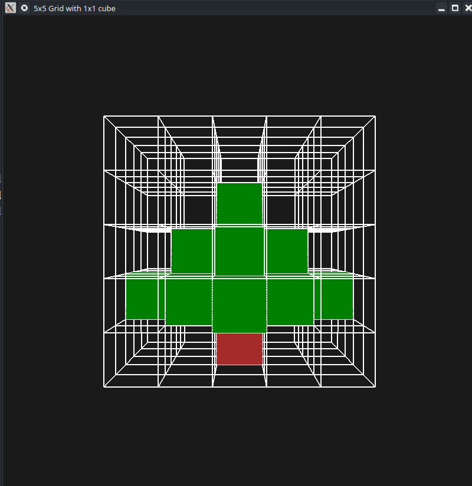

## Team Members
- Aryan 112301041
- Sujit 112301001

---

## Output Model


https://github.com/user-attachments/assets/60c40134-def0-42b4-a17f-ba22eb380d5b

## Working Principle

- The application uses **OpenGL, GLFW, GLEW, and GLM** to create and render the Grid and cube.
- A 5×5×5 grid is generated using lines parallel to the three coordinate axes.
- A 1×1×1 cube is placed inside the grid and its position is controlled using keyboard input.
- Each grid cell can be stored as either filled or unfilled, along with the RGB color assigned to it.
- Keyboard controls allow the user to move the cube, change its color, fill or clear cells, and rotate the complete grid.
- The grid and cubes are transformed using model, view, and projection transformations to produce the final 3D view.
- Vertex and fragment shaders are used to transform vertices and assign colors to the rendered objects.
- The program continuously updates the scene according to user input inside the OpenGL rendering loop.

## Implementation Details

### 1. Program and OpenGL Initialization

- The `main()` function initializes GLFW and creates an **800×800 OpenGL window**.
- GLEW is initialized to provide access to OpenGL functions.
- `GL_DEPTH_TEST` is enabled so that objects at different depths are rendered correctly.
- `glViewport()` sets the rendering area to the size of the window.

### 2. 3D Grid Generation

- The function `generateGrid(vector<float>& a, int n)` generates the vertices required for the 3D grid.
- Three sets of loops generate lines parallel to the **X, Y, and Z axes**.
- For a grid size of `n = 5`, the coordinates range from 0 to 5, producing the complete 5×5×5 grid structure.
- The generated vertices are stored in a VBO and associated with a VAO.
- The grid is rendered using `glDrawArrays()`.

### 3. Unit Cube Generation

- The function `generateCube(vector<float>& a)` creates the eight vertices of a 1×1×1 cube.
- The cube is initially defined from `(0,0,0)` to `(1,1,1)`.
- An index array `cubeIndices` defines the two triangles required for each of the six cube faces.
- A separate `cubeVAO`, `cubeVBO`, and `cubeEBO` are created for rendering the cube.
- The cube is rendered using `glDrawElements()`.

### 4. Cell Representation

- The `Cell` structure stores the state and color of each grid cell.
- It contains:
  - `filled` — indicates whether the cell has been permanently filled.
  - `r`, `g`, and `b` — store the RGB color of the filled cell.
- A `5×5×5` array named `cells` stores information for all 125 cells in the grid.

### 5. Cube Movement

- The variables `cubeX`, `cubeY`, and `cubeZ` store the current position of the movable cube.
- The `key_callback()` function handles keyboard input.
- Arrow keys modify `cubeX` and `cubeY`, while `U` and `B` modify `cubeZ`.
- Boundary conditions ensure that the cube remains inside the valid range of `0` to `4`.

### 6. Changing Cube Color

- When the user presses `C`, `key_callback()` requests three floating-point RGB values from the terminal.
- These values are stored in `colR`, `colG`, and `colB`.
- The values are later passed to the shader through the `objectColor` uniform.

### 7. Filling a Grid Cell

- When `F` is pressed, `key_callback()` sets the current cell's `filled` value to `true`.
- The current RGB values are copied into that cell's `r`, `g`, and `b` members.
- During rendering, the program checks every cell in the `cells` array and renders only those whose `filled` value is true.
- Each filled cell is positioned using `glm::translate()` according to its `(x,y,z)` coordinates.

### 8. Clearing a Grid Cell

- When `W` is pressed, the current cell `filled` value is set to `false`.
- Its stored RGB values are also reset.
- Since unfilled cells are skipped during rendering, the cell disappears from the model.

### 9. Grid Rotation

- `rotateX` and `rotateY` store the current rotation angles.
- `L` and `R` modify `rotateY`, while `T` and `D` modify `rotateX`.
- The rotation transformation is constructed around the center of the grid at `(2.5, 2.5, 2.5)`.
- The same `rotation` matrix is applied to the grid, filled cells, and movable cube, keeping their relative positions consistent.

### 10. Camera and Transformations

- A view matrix is created using `glm::lookAt()` to position the camera at `(10,10,10)` and look toward the center of the grid.
- A perspective projection is created using `glm::perspective()`.
- The final transformation is calculated as:

```text
MVP = Projection × View × Rotation × Model
```

- The MVP matrix is passed to the vertex shader using `glUniformMatrix4fv()`.

### 11. Shader Management

- `readFile()` in `shadersUtil.cpp` reads the vertex and fragment shader source files.
- `vertexShaderCompileLog()` and `fragmentShaderCompileLog()` are provided to check shader compilation errors.
- `ShaderLinkingCheck()` checks whether the shader program was successfully linked.
- The shader program uses the `MVP` uniform for vertex transformation and `objectColor` for assigning the object's color.

### 12. Main Rendering Loop

- The rendering process runs continuously inside the `while(!glfwWindowShouldClose(window))` loop.
- The color and depth buffers are cleared at the beginning of every frame.
- The grid is rendered first.
- All permanently filled cells are then rendered.
- Finally, the currently movable cube is translated to `(cubeX, cubeY, cubeZ)` and rendered using its current color.
- `glfwSwapBuffers()` displays the completed frame, while `glfwPollEvents()` processes keyboard events.

### 13. Resource Cleanup

- At the end of the program, the VAOs, VBOs, EBO, and shader program are deleted.
- The GLFW window is destroyed and GLFW is terminated to release resources.
